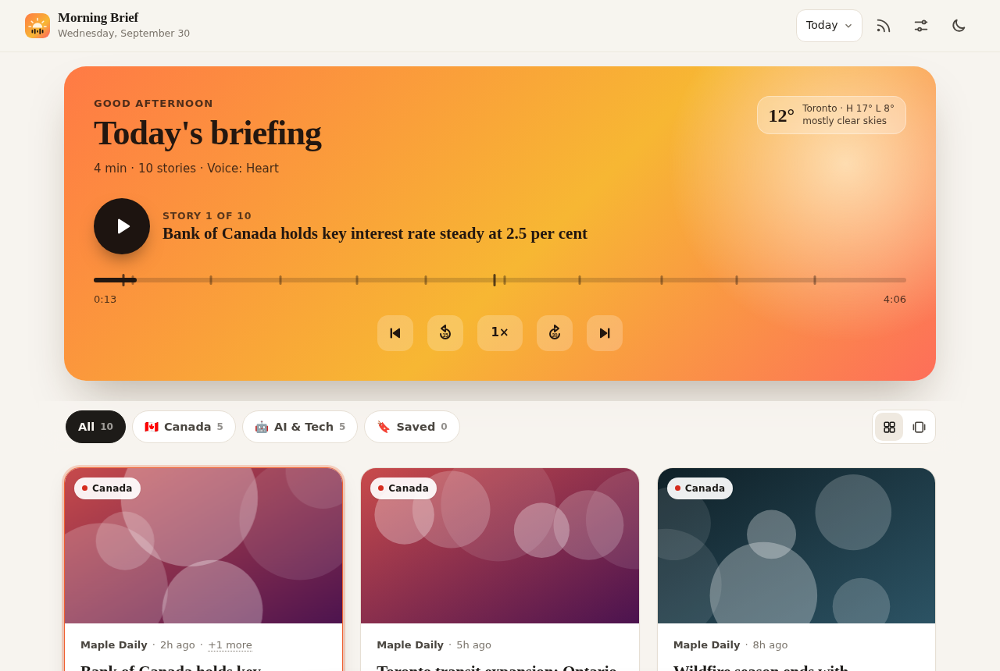
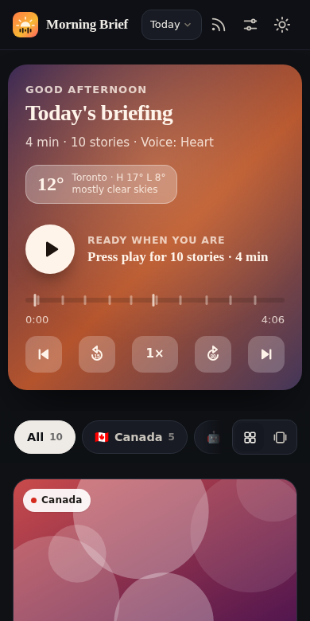
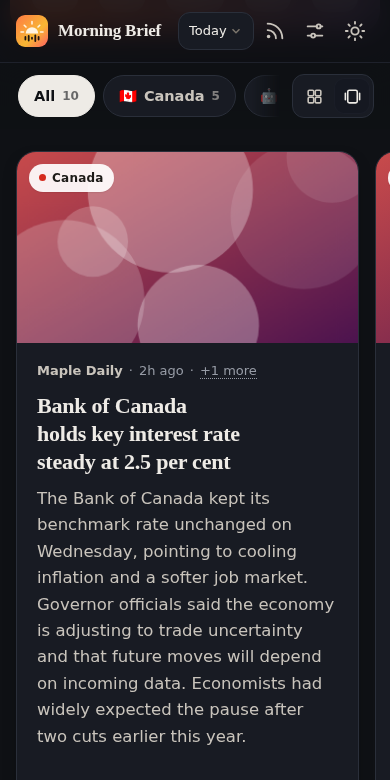
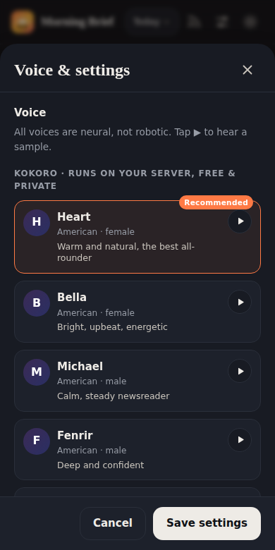

# ☀️ Morning Brief Voice

Your daily news on cards, **read aloud every morning by a natural neural voice**. It covers
**top Canadian news** and **AI & tech**, plus any sites or articles each person adds themselves.
It's built for a small group (20–30 people): everyone signs in, adds their own links, and gets their own
briefing and a phone notification each morning.



| Mobile (dark) | Swipe deck | Voice picker |
|---|---|---|
|  |  |  |

## Architecture

```
 Phone / browser (PWA)                    Supabase (free tier)                    Linux server (Docker)
 mbv.vattitude.ca on Vercel      ┌───────────────────────────────┐      ┌──────────────────────────────┐
 ─ sign in with an email code ──►│ Auth (email one-time code)    │      │ worker (python -m app worker)│
 ─ add links, pick voice ───────►│ tables: profiles, sources,    │◄────►│ ─ daily batch at BATCH_TIME  │
 ─ read cards ◄──────────────────│   briefings, push subs,       │      │ ─ fetch → rank → summarize   │
 ─ stream MP3 ◄──────────────────│   build_requests, app_status  │      │   (Groq, falls back to the   │
                                 │ Storage bucket "briefings":   │◄─────│   built-in summarizer)       │
 ◄── Web Push "Your brief is     │   <feed_token>/<date>.mp3     │      │ ─ Kokoro voice → MP3 upload  │
     ready" ─────────────────────┴───────────────────────────────┘      │ ─ Web Push to users + admin  │
                                                                         └──────────────────────────────┘
```

- **Vercel** serves only static files from `web/`. It has no backend and holds no secrets.
- **Supabase** stores everything. Row-level security keeps each user to their own rows. MP3s live in a
  public bucket under an unguessable per-user token.
- **The Linux server** makes only outbound HTTPS calls to Supabase, Groq, the news sites and the push services.
  Nothing on it is exposed to the internet, so no tunnel or port-forwarding is needed. It can sleep overnight.

### The daily batch

1. **Gathers** headlines from the built-in feeds (CBC, Global News, Globe and Mail, National Post, CityNews,
   TechCrunch, The Verge, MIT Tech Review, Ars Technica, VentureBeat, BetaKit, Hacker News…) and every user's
   links. Each feed is fetched **once** even if several people use it. A newly added link is identified
   (RSS feed, section page or single article) at its first build.
2. **Ranks** stories per user. A story covered by several outlets becomes one card.
3. **Summarizes** each unique story **once** with Groq (`llama-3.3-70b-versatile`, then `llama-3.1-8b-instant`).
   Summaries are cached, so 30 users with overlapping news cost about the same as one.
4. **Records** each user's MP3 with their voice and speed. Spoken segments are cached, and chapters mark every story.
5. **Uploads** the MP3, saves the briefing, **notifies** the user, and deletes anything older than `KEEP_DAYS`.

## When things go wrong (and who hears about it)

| Situation | What happens | User sees | Admin gets |
|---|---|---|---|
| Groq per-minute limit (429) | Waits for `retry-after` (≤ 65 s) and retries | nothing, or a note if it gave up | ⚠️ push |
| Groq **daily** limit reached | Switches to the next model, then the built-in summarizer | "AI summaries hit today's free limit…" note | ⚠️ push |
| Groq key invalid / revoked | Built-in summarizer for the whole run | note on the briefing | ❌ push |
| Groq down (5xx / timeouts) | Retries, then the built-in summarizer | note on the briefing | ⚠️ push |
| A user's link can't be read | Skipped; red dot in Sources | "1 of your links couldn't be read" | ⚠️ push |
| Kokoro voice fails | Uses the backup Microsoft voice | note on the briefing | ⚠️ push |
| Upload / Supabase outage | That user's briefing fails, and the rest continue | "couldn't be built today" banner | ❌ push |
| Server asleep at batch time | Catches up when it wakes (until noon) | "running late" banner | summary push |

Admin pushes go to every device an admin (`ADMIN_EMAILS`) has subscribed. `ADMIN_NOTIFY=issues` (default) sends
one only when something went wrong. `always` sends one after every run, and `off` sends none. Ad-hoc runs always report.
The admin's devices are cached on the server, so the "Supabase is down" alert still arrives.

## Setup

### 1. Supabase (once)

1. Create a project. In **SQL Editor**, run [`supabase/schema.sql`](supabase/schema.sql).
   It is safe to re-run after updates.
2. **Authentication → Sign In / Providers → Email**: keep Email enabled. Turn **off** "Allow new users to sign up"
   so only people you add can get in.
3. **Authentication → Email Templates → Magic Link**: include the code, e.g.
   `<h2>Your Morning Brief code</h2><p>{{ .Token }}</p>`. Users type the code into the app, which works inside an
   installed PWA, where magic links would open a different browser.
4. **Authentication → Users → Add user** for each person (email, "auto confirm"). Their profile is created automatically.
5. **Settings → API keys**: copy the *publishable* key into [`web/config.js`](web/config.js). It's public by design.
   Put the **secret** key only in the server's `.env`.
6. For more than a few sign-ins an hour, set up custom SMTP under **Authentication → Emails**, because the built-in
   sender is heavily rate-limited. A free-tier project pauses after 7 days with no activity, and the daily batch counts as activity.

### 2. Web app on Vercel

- Import the GitHub repo. Set **Root Directory** to `web` and **Framework Preset** to `Other`, with no build command.
- **Domains**: add `mbv.vattitude.ca`. At WHC, add a `CNAME` record `mbv → cname.vercel-dns.com`.
- Open the site on your phone and choose **Add to Home Screen**. Then, in Settings, turn on **Morning notification**.

### 3. Server (Linux + Docker)

```bash
git clone https://github.com/vattitude-me/morning-brief-voice.git
cd morning-brief-voice
cp .env.example .env     # fill SUPABASE_URL, SUPABASE_SECRET_KEY, GROQ_API_KEY, ADMIN_EMAILS
docker compose up -d --build
docker compose exec worker python -m app check    # tests Supabase + Groq
docker compose logs -f
```

The Kokoro model (~350 MB) is baked into the image. VAPID push keys are generated on first start in `data/`.

## Testing a build on demand

```bash
./scripts/run-now.sh --user you@example.com   # just you
./scripts/run-now.sh                          # everyone
```

This runs the same pipeline as the morning batch, but first **starts over**. It deletes today's briefing
and MP3, clears cached summaries and audio, and re-queues single-article links that were already used. It then
prints the new brief in the terminal (headlines, summaries, who wrote them, audio URL, any problems) and pushes
the result to the admin. Add `--no-push` to stay quiet. It won't start while another build is running.

Admins also get a **Build now** button in the app (Settings → Rebuild). The server picks it up within a minute.

## Schedule and the sleep cycle

The worker runs the batch at `BATCH_TIME` in `BRIEFING_TIMEZONE`. If the server was asleep at that time, it catches up
as soon as it wakes (before noon).

**QA** (current): the server suspends at 01:00 and wakes at 07:00, and `BATCH_TIME=07:05`.

**Production**: wake at 05:45 and build at 06:00. On the server:

```bash
sudo crontab -e
# change the wake line to (suspend at 01:00, wake at 05:45):
0 1 * * * /usr/sbin/rtcwake -m mem -t "$(date -d 'tomorrow 05:45' +\%s)"

# then in ~/morning-brief-voice/.env
BATCH_TIME=06:00
docker compose up -d
```

## Configuration (`.env` on the server)

| Variable | Default | |
|---|---|---|
| `SUPABASE_URL` | | Project URL |
| `SUPABASE_SECRET_KEY` | | **Server only.** Never commit or share |
| `GROQ_API_KEY` | | Free at console.groq.com. Without it, summaries are built-in |
| `GROQ_MODELS` | `llama-3.3-70b-versatile,llama-3.1-8b-instant` | Tried in order |
| `BRIEFING_TIMEZONE` | `America/Toronto` | |
| `BATCH_TIME` | `07:05` | 24-hour clock |
| `KEEP_DAYS` | `2` | Briefings and MP3s older than this are deleted |
| `ADMIN_EMAILS` | | Comma-separated. Admin push + Build now |
| `ADMIN_NOTIFY` | `issues` | `issues`, `always` or `off` |
| `VAPID_SUBJECT` | | `mailto:you@example.com` for push services |
| `MAX_CUSTOM_SOURCES` | `15` | Links per user used each day |

## Development

```bash
python -m venv .venv && . .venv/bin/activate
pip install -r requirements.txt pytest
pytest -q
```

Tests run offline with fake feeds (`tests/fakenews.py`), a fake Supabase store and a fake Groq client.
