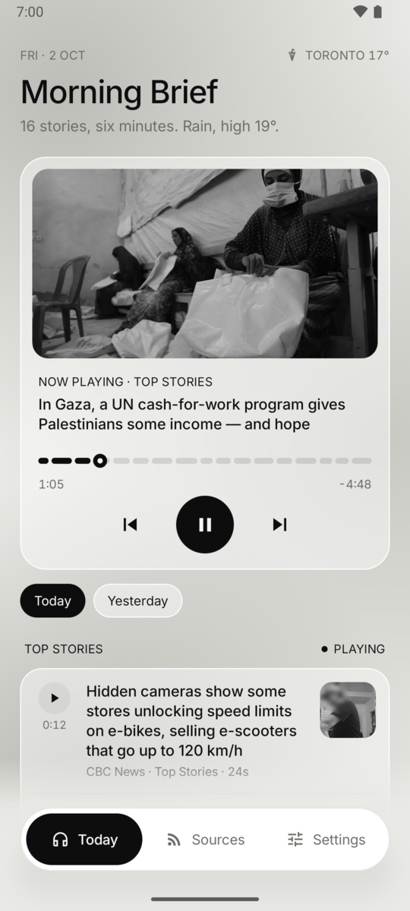
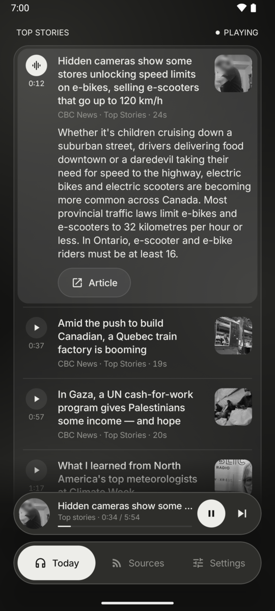
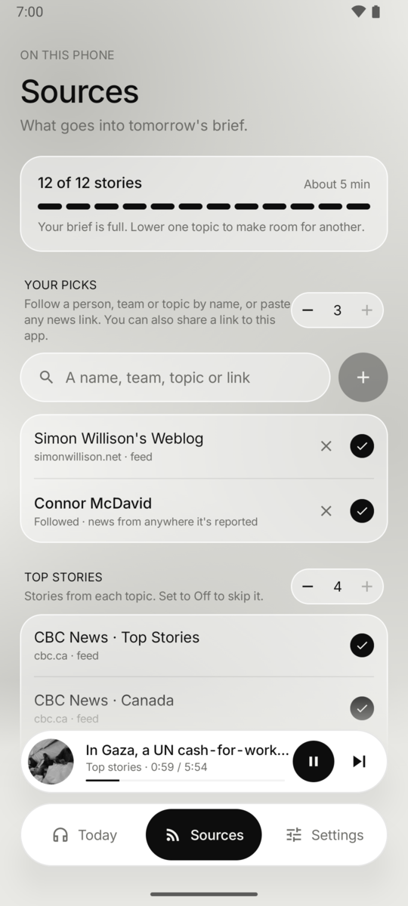
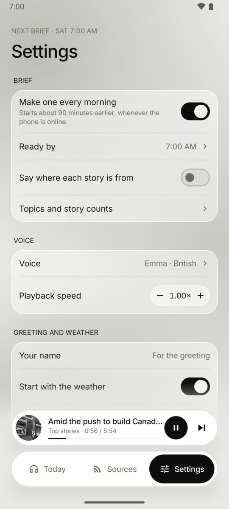

# Morning Brief for Android

A standalone Android app that builds the briefing **on the phone**. It fetches the feeds, ranks them, writes the
summaries and records them in a natural voice, then plays the result. No server is needed. Signing in with Google
(the same account as the web app) is optional; it syncs your settings and sources.

| Today | Following along | Sources | Settings |
|---|---|---|---|
|  |  |  |  |

- **About five minutes:** 12 stories in total, at most 4 per topic. Sources shows how full the brief is.
- **Sources:** topics, local news for your city, and *Your picks*: follow a name or add any site or link.
  Changes are a draft until you save them.
- **Follow along:** the story being read is highlighted and scrolled into view. Tap ▶ beside any story to start there.
  A mini player follows you to the other tabs.
- **Summaries:** built in, or written by an AI service with your own key: Groq, Gemini, OpenRouter, OpenAI or any
  OpenAI-compatible endpoint.
- **First run:** a short setup with a sample briefing to hear, then voice, morning time and notifications, and an
  optional summary key.
- **Voices:** Settings → Voice → Natural downloads the Kokoro model (about 350 MB, once) and runs it offline with
  [sherpa-onnx](https://github.com/k2-fsa/sherpa-onnx). Otherwise the phone's own voice reads the briefing.
- **Every morning:** builds before your "ready by" time, and again if a scheduled build was missed.

Android 10+. Download the APK from the [releases](https://github.com/vattitude-me/morning-brief-voice/releases)
tagged `android-v*`. Store listing text and assets are in [`docs/play-store`](../docs/play-store).

## Build

```bash
cd android
./gradlew testDebugUnitTest assembleDebug     # needs JDK 21 and the Android SDK
```

Release builds are signed from `keystore.properties` (gitignored) or the `ANDROID_KEYSTORE*` environment variables.
Google sign-in returns to `<applicationId>://auth`, so add `me.vattitude.morningbrief://auth` (and the `.debug` one)
to Supabase → Authentication → URL Configuration → Redirect URLs.
Pushing a tag like `android-v0.2.0` makes CI build a signed APK and attach it to a GitHub release.
